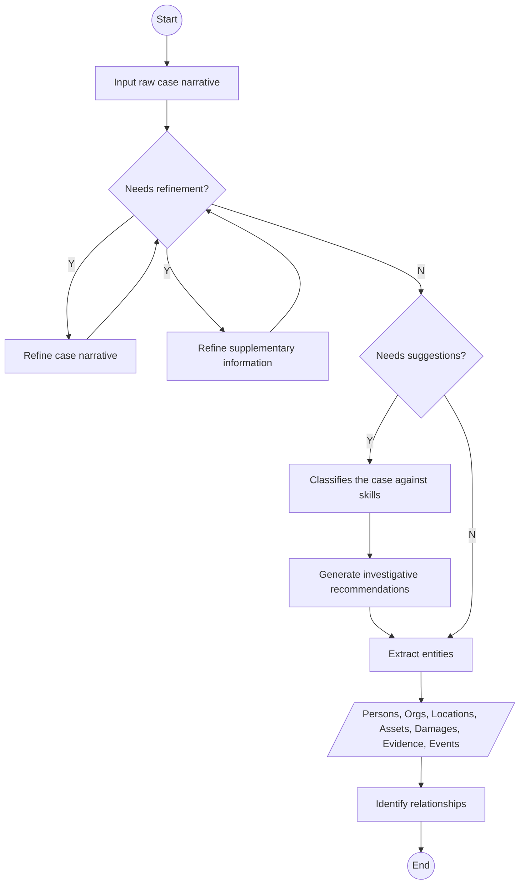

# BlueScope

> 🇹🇭 [ภาษาไทย](README.th.md)

A lightweight, open-source intelligence toolkit built for investigative work. BlueScope transforms raw case data into clear, dependable AI-driven insights, streamlining investigative analysis and supporting precise, evidence-based decision-making.

## Overview

BlueScope is a **local-first, cross-platform desktop application** built on Electron, designed to assist investigators in processing criminal case narratives — particularly tailored for **Thai law enforcement**. Users input raw case text, and a pipeline of specialized LLM agents:

1. Refines the narrative for clarity
2. Extracts structured entities (persons, organizations, locations, assets, evidence, and events)
3. Infers relationships between entities and builds a visual network graph
4. Classifies the case against a 58-skill Thai criminal law taxonomy
5. Generates domain-specific investigative advisory reports

All data is stored locally on-device; nothing leaves the machine except API calls to the chosen LLM provider.

## Tech Stack

| Layer | Technology |
|---|---|
| Desktop shell | Electron + Electron Forge |
| Frontend | React 19 + TypeScript + Vite |
| UI components | Material UI v9 |
| Routing | React Router v7 |
| State management | Zustand |
| Database | SQLite (`better-sqlite3`) + Drizzle ORM |
| AI / LLM | Vercel AI SDK |
| Build orchestration | Turborepo |
| Linting / formatting | Biome |
| i18n | Paraglide.js — English & Thai |
| Schema validation | Zod |

## Monorepo Structure

This repository is a **Turborepo monorepo** with two apps and four packages:

```
bluescope/
├── apps/
│   ├── main/       — Electron main process (IPC handlers, SQLite, migrations, window management)
│   └── renderer/   — React SPA (UI, routing, AI streaming display)
└── packages/
    ├── agents/     — AI agent classes built on the Vercel AI SDK
    ├── modules/    — Electron IPC bridge modules
    ├── repos/      — Drizzle ORM database repositories
    └── skills/     — Thai criminal law skill taxonomy
```

The [Thai criminal law skill taxonomy](packages/skills/README.md) in `packages/skills` consists of 58 Markdown files corresponding to each category of Thai criminal law, with specific prompts and guidelines for each skill.

## Data Flow

The following end-to-end pipeline shows how a raw case narrative becomes structured intelligence:



## Key Design Decisions

- **Local-first**: All case data is stored on-device in SQLite. No cloud sync. API keys are encrypted in a separate file.
- **Multi-LLM**: Supports 15+ providers via the Vercel AI SDK abstraction, making it easy to swap models without code changes.
- **Bilingual**: All agents support both English and Thai prompts; the UI supports both languages via Paraglide.js i18n.
- **Streaming**: AI responses stream in real-time to the UI via Electron IPC, using the Vercel AI SDK's streaming API.
- **Domain-specific**: The 58 Thai criminal law skills make the tool deeply tailored to Thai law enforcement use cases, with classification and advisory prompts written for each specific offence category.
- **Modular monorepo**: Turborepo keeps `agents`, `modules`, `repos`, and `skills` as independently buildable and testable packages, while sharing types across the workspace.

## Getting Started

### Prerequisites

- Node.js 24+
- npm 11+

### Install dependencies

```sh
npm install
```

### Development

```sh
npm run dev
```

Starts the Vite dev server for the renderer and the Electron main process concurrently via Turborepo.

### Start

```sh
npm run start
```

Starts the electron application locally in production mode.

### Package for distribution

```sh
npm run dist
npm run package
```

Produces a packaged Electron application.

### Create installers

```sh
npm run make
```

Generate platform-specific installers, ZIP archives for Windows.
