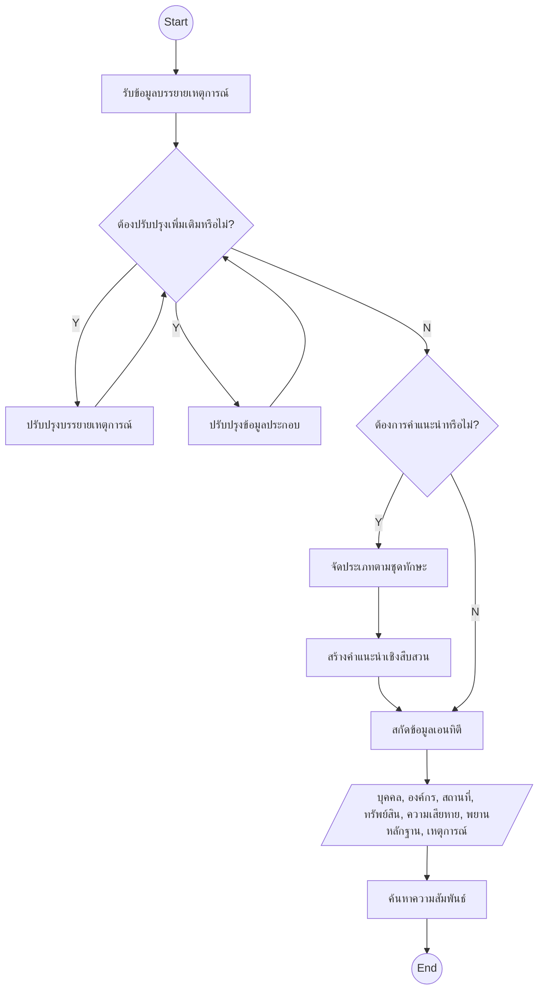

# BlueScope

> 🇬🇧 [English](README.md)

ชุดเครื่องมือสำหรับงานสืบสวนสอบสวน BlueScope แปลงข้อมูลคดีให้กลายเป็นข้อมูลเชิงลึกที่ชัดเจนและเชื่อถือได้ ด้วยพลังของปัญญาประดิษฐ์ เพื่อสนับสนุนการวิเคราะห์คดีและการตัดสินใจที่มีหลักฐาน

## ภาพรวม

BlueScope คือ **แอปพลิเคชันเดสก์ท็อปแบบ local-first ข้ามแพลตฟอร์ม** ที่สร้างบน Electron ออกแบบมาเพื่อช่วยเจ้าหน้าที่สืบสวนในการประมวลผลเรื่องราวคดีอาญา — โดยเฉพาะอย่างยิ่งสำหรับ **เจ้าหน้าที่ตำรวจไทย** ผู้ใช้ป้อนข้อความคดีดิบ แล้วไปป์ไลน์ของ AI เฉพาะทางจะดำเนินการดังนี้:

1. ปรับปรุงเรื่องราวให้ชัดเจนและกระชับ
2. สกัดข้อมูลเอนทิตีเชิงโครงสร้าง (บุคคล องค์กร สถานที่ ทรัพย์สิน หลักฐาน และเหตุการณ์)
3. อนุมานความสัมพันธ์ระหว่างเอนทิตีและสร้างกราฟเครือข่ายเชิงภาพ
4. จัดหมวดหมู่คดีตามอนุกรมวิธานทักษะกฎหมายอาญาไทย 58 ทักษะ
5. สร้างรายงานคำแนะนำการสืบสวนเฉพาะด้าน

ข้อมูลทั้งหมดจะถูกจัดเก็บภายในเครื่องของตัวเอง ไม่มีข้อมูลออกจากเครื่องนอกจากการเรียกใช้ API กับ LLM Provider ที่เลือก

## เทคโนโลยีที่ใช้

| ชั้น | เทคโนโลยี |
|---|---|
| Desktop shell | Electron + Electron Forge |
| Frontend | React 19 + TypeScript + Vite |
| UI components | Material UI v9 |
| Routing | React Router v7 |
| State management | Zustand |
| Database | SQLite (`better-sqlite3`) + Drizzle ORM |
| AI / LLM | Vercel AI SDK |
| Build orchestration | Turborepo |
| Linting / formatting | Biome |
| i18n | Paraglide.js — อังกฤษ & ไทย |
| Schema validation | Zod |

## โครงสร้าง Monorepo

Repository นี้เป็น **Turborepo monorepo** ที่ประกอบด้วย 2 แอปและ 4 แพ็กเกจ:

```
bluescope/
├── apps/
│   ├── main/       — Electron main process (IPC handlers, SQLite, migrations, window management)
│   └── renderer/   — React SPA (UI, routing, AI streaming display)
└── packages/
    ├── agents/     — AI agent classes สร้างบน Vercel AI SDK
    ├── modules/    — Electron IPC bridge modules
    ├── repos/      — Drizzle ORM database repositories
    └── skills/     — อนุกรมวิธานกฎหมายอาญาไทย
```

[อนุกรมวิธานทักษะกฎหมายอาญาไทย](packages/skills/README.md)ใน `packages/skills` ประกอบด้วยไฟล์ Markdown 58 ไฟล์ที่สอดคล้องกับทักษะกฎหมายอาญาไทยแต่ละประเภท โดยมีพรอมต์และคำแนะนำเฉพาะสำหรับแต่ละทักษะ

## ขั้นตอนการทำงาน (Data Flow)

ไปป์ไลน์ตั้งแต่ต้นจนจบแสดงให้เห็นว่าเรื่องราวคดีดิบกลายเป็นข่าวกรองเชิงโครงสร้างได้อย่างไร:



## การออกแบบที่สำคัญ

- **Local-first**: ข้อมูลคดีทั้งหมดจัดเก็บในเครื่องด้วย SQLite ไม่มีการ sync กับ cloud ส่วน API key จะถูกเข้ารหัสในไฟล์ที่แยกต่างหากและไม่ถูกเก็บในฐานข้อมูล
- **Multi-LLM**: รองรับ provider มากกว่า 15 รายผ่าน Vercel AI SDK abstraction ทำให้สลับโมเดลได้โดยไม่ต้องแก้โค้ด
- **สองภาษา**: เอเจนต์ทั้งหมดรองรับพรอมต์ทั้งภาษาอังกฤษและไทย รวมถึง UI รองรับทั้งสองภาษาผ่าน Paraglide.js
- **Streaming**: ผลลัพธ์ AI stream แบบเรียลไทม์ไปยัง UI ผ่าน Electron IPC โดยใช้ Vercel AI SDK streaming API
- **เฉพาะด้าน**: ทักษะกฎหมายอาญาไทย 58 ทักษะทำให้เครื่องมือนี้เหมาะกับการใช้งานของตำรวจไทย มีพรอมต์ การจัดหมวดหมู่และคำแนะนำที่เขียนเฉพาะสำหรับแต่ละประเภทความผิด
- **Modular monorepo**: Turborepo แยก `agents`, `modules`, `repos` และ `skills` เป็นแพ็กเกจที่ build และทดสอบได้อิสระ พร้อมแชร์ types ทั่วทั้ง workspace

## เริ่มต้นใช้งาน

### ข้อกำหนดเบื้องต้น

- Node.js 24+
- npm 11+

### ติดตั้ง dependencies

```sh
npm install
```

### Development

```sh
npm run dev
```

เริ่ม Vite dev server สำหรับ renderer และ Electron main process พร้อมกันผ่าน Turborepo

### Start

```sh
npm run start
```

เริ่มแอปพลิเคชัน Electron ในโหมด production บนเครื่องของคุณเอง

### Package สำหรับการแจกจ่าย

```sh
npm run dist
npm run package
```

สร้างแอป Electron ที่แพ็กแล้วไว้ในโฟลเดอร์

### สร้าง installer

```sh
npm run make
```

สร้าง installer สำหรับแต่ละแพลตฟอร์ม, ZIP สำหรับ Windows
